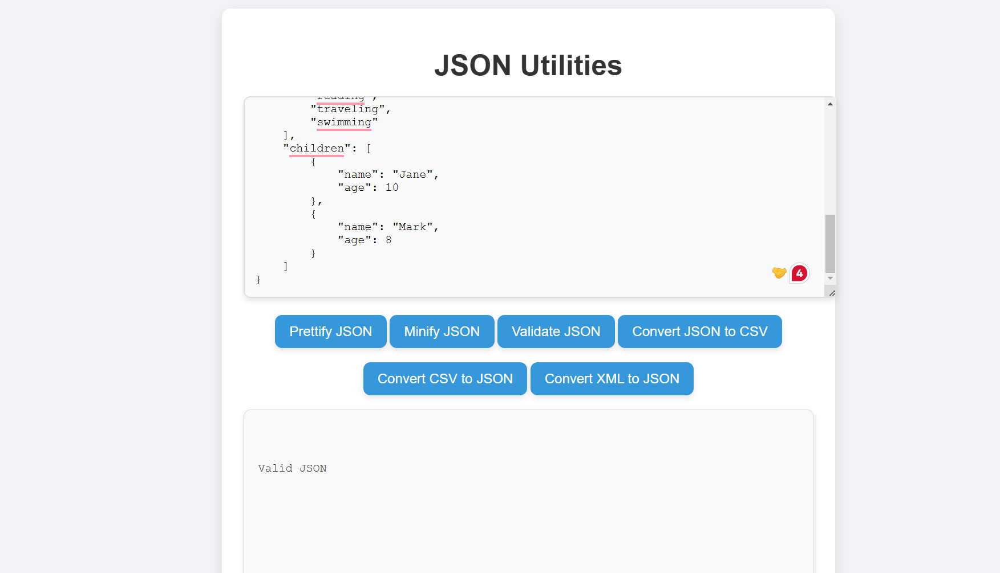
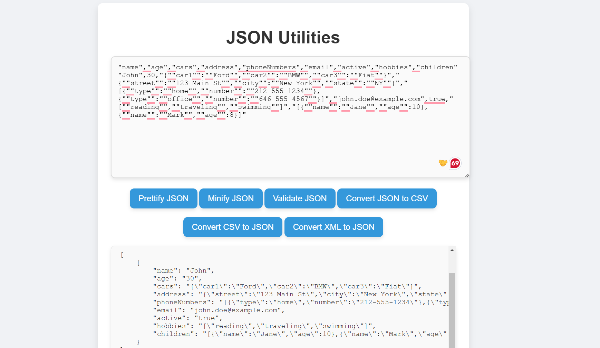
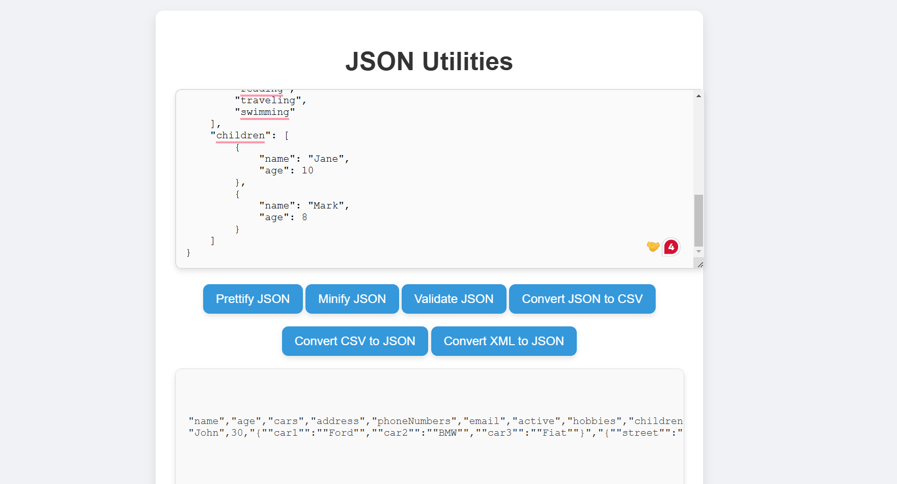
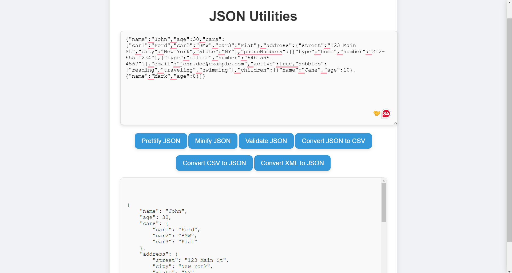
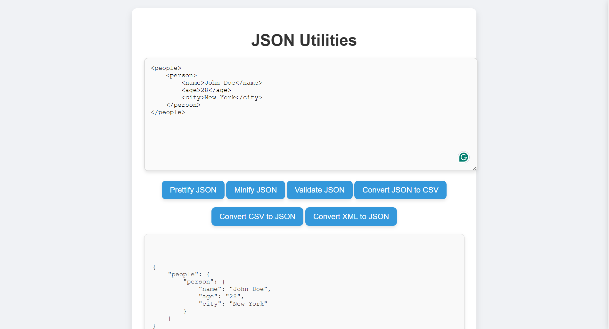

# JSON Formatter Tools

A collection of tools to help you work with JSON data efficiently! This repository provides easy-to-use utilities for common JSON tasks such as format validation, conversions between JSON and CSV, minifying and prettifying JSON, and converting XML to JSON.

## Features

### 1. **Check JSON Validity**
   - Tool to validate JSON data and ensure it’s well-formed.
   - 

### 2. **CSV to JSON**
   - Convert CSV files to JSON format.
   - 

### 3. **JSON to CSV**
   - Transform JSON data into a CSV file for easier data analysis.
   - 

### 4. **Minify and Prettify JSON**
   - Minify JSON for compact storage or prettify it for readability.
   - 

### 5. **XML to JSON**
   - Convert XML data to JSON for easier integration in modern applications.
   - 

## Getting Started

To use these tools, you can simply run the Docker Compose file included in this repository.

### Prerequisites

- **Docker** and **Docker Compose** must be installed on your machine. You can download them from the following links:
  - [Docker Installation Guide](https://docs.docker.com/get-docker/)
  - [Docker Compose Installation Guide](https://docs.docker.com/compose/install/)

### Running the Tools

1. **Clone the Repository**
   ```bash
   git clone https://github.com/Lucifer7355/JSON_Formatter.git
   cd JSON_Formatter
